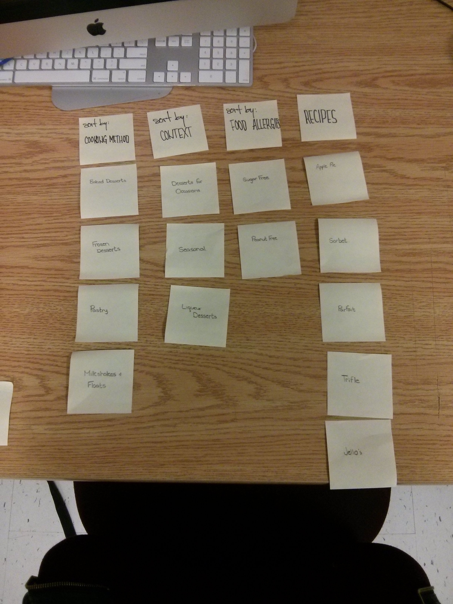
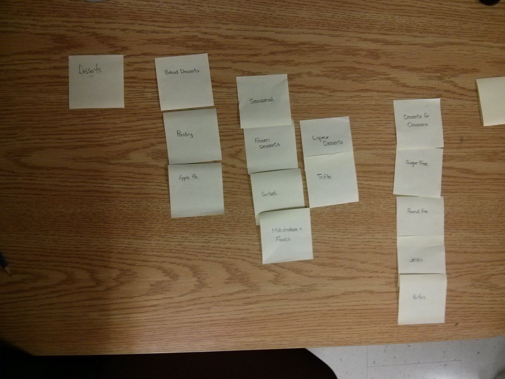

# Card sort report

The purpose of this card sort was to determine common navigation patterns and categories from the content of amuelb.github.io.

## Specifics

The card sort was conducted by Amy Brown on 09/10/13 between the times of 4pm and 6pm with the following participants:

- James Gollner
- Chris Chan

### Cards

15 cards were used covering a broad range of applicable content for the website. The following topics were used as cards:

1. Baked Desserts
2. Frozen Desserts
3. Pastry
4. Milkshakes and Floats
5. Desserts for Occasions
6. Seasonal
7. Liqueur Desserts
8. Sugar Free
9. Peanut Free
10. Apple Pie
11. Sorbet
12. Parfait
13. Trifle
14. Jellos
15. Cake

## Card sort results

*Card sort 1 by Chris Chan*

*Card sort 2 by James Gollner*

## Observations

- Did the participants have any common comments?

- Did they have questions that stood out?

Because it is a recipe website, they both found it difficult to determine the categories on paper, but knew how it would work in an online environment.

- Did they struggle with certain articles or topics?

Both participants couldn't figure out where the Peanut free or Sugar Free desserts would be located.

- Did they find common groupings? Or were the groupings completely different?

The groupings for 

- Were some of the groupings completely unexpected?
- Were the results similar to your expectations?
- How did you feel while watching them perform the task?